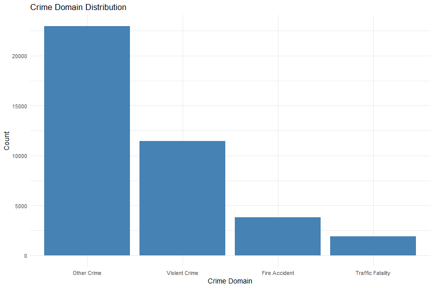
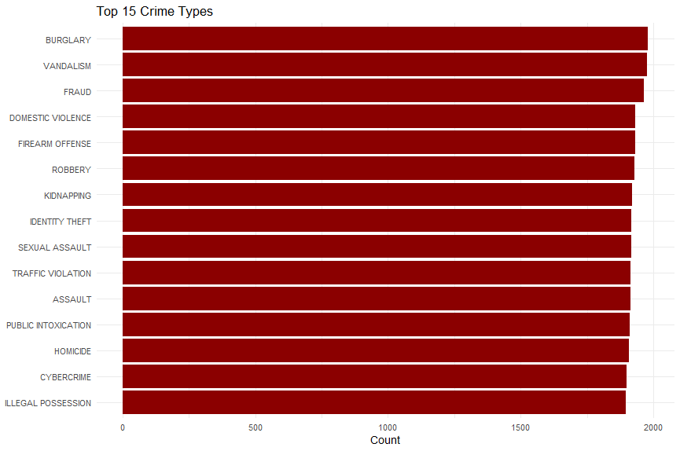
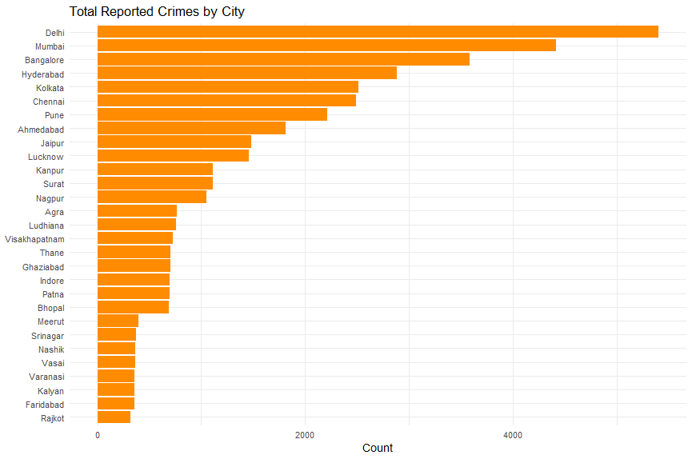
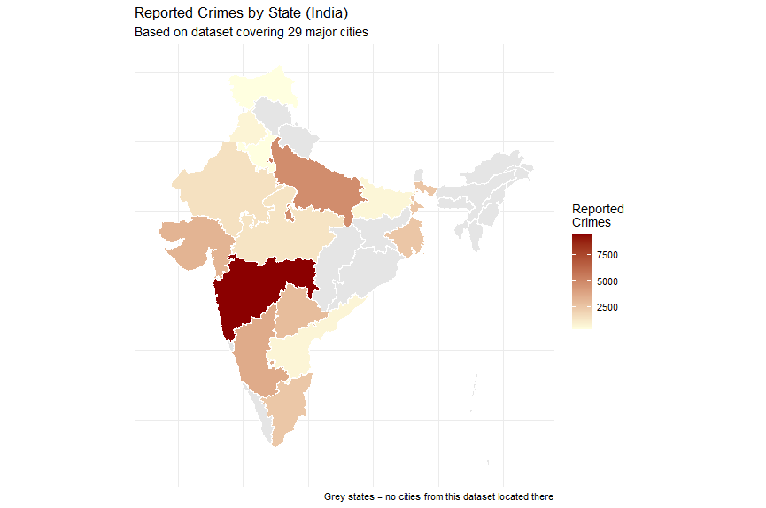
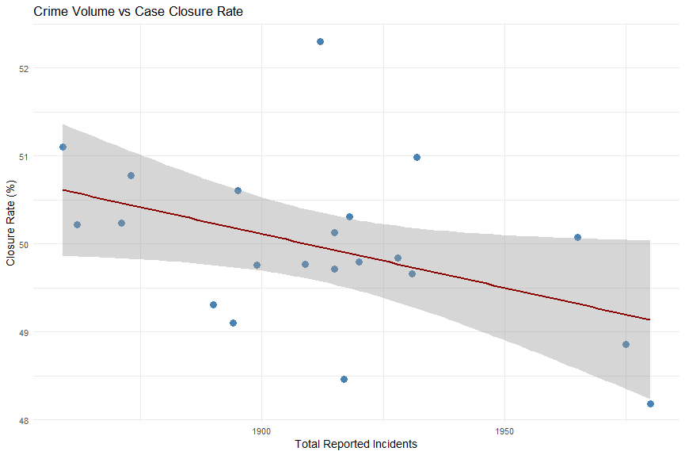

# India Crime Analytics
### Statistical Exploration of Reported Crime Patterns Across Major Cities

A data analysis project built in **R**, examining reported crime data across 29 major Indian cities. The project covers data cleaning, exploratory analysis, geographic visualization, and statistical modelling (correlation & regression).

> ⚠️ **Note on scope:** This analysis is based on reported crime records only. Crime data is subject to reporting and sampling biases across regions, and results should be interpreted as patterns in *reported* incidents — not as claims about actual crime rates, specific communities, or predictive policing.

---

## 📊 Dataset

- Source: [Crime Dataset India](https://www.kaggle.com/datasets) (Kaggle)
- **40,160 records** across **29 major Indian cities**
- Key columns: `date_of_occurrence`, `city`, `crime_description`, `crime_domain`, `victim_age`, `victim_gender`, `weapon_used`, `police_deployed`, `case_closed`

---

## 🛠️ Tech Stack

- **R** / RStudio
- `tidyverse` — data wrangling & visualization
- `janitor` — column name cleaning
- `lubridate` — date/time parsing
- `sf` + `geodata` — geospatial mapping (India state boundaries via GADM)
- `scales` — formatting for plots

---

## 🔍 Methodology

1. **Data Cleaning** — standardized column names, parsed mixed-format datetime strings (`MM-DD-YYYY HH:MM`), removed inconsistencies
2. **Exploratory Analysis** — crime type & domain distributions, city-wise breakdowns
3. **Geographic Mapping** — cities mapped to their respective Indian states, aggregated into a state-level choropleth
4. **Statistical Analysis** — Pearson correlation and simple linear regression to test the relationship between crime volume and case closure rate

---

## 📈 Visualizations

### 1. Crime Domain Distribution


"Other Crime" accounts for 57.1% of all reported incidents, followed by Violent Crime (28.6%), Fire Accident (9.5%), and Traffic Fatality (4.8%).

### 2. Top 15 Crime Types


The top 15 crime types are fairly evenly distributed (1,895–1,980 incidents each), showing no single dominant crime category.

### 3. Total Reported Crimes by City


Delhi and Mumbai report the highest incident volumes, with a gradual step-down across the remaining cities.

### 4. Reported Crimes by State (Choropleth Map)


Maharashtra leads by a wide margin — a result of multiple sampled cities (Mumbai, Pune, Nagpur, Thane, Nashik, Vasai, Kalyan) falling within the state. Grey regions indicate states with no sampled cities in this dataset.

### 5. Crime Volume vs Case Closure Rate


A statistically significant **negative correlation** (r = -0.44, p = 0.046) was found between how frequently a crime type occurs and its closure rate — higher-volume crime types tend to have slightly lower closure rates. However, the regression model's R² = 0.193 means incident volume alone explains only ~19% of the variance in closure rate, indicating other factors (police deployment, crime severity, etc.) play a larger role.

---

## 📌 Key Findings

- No single crime category dominates reported incidents — the spread across top crime types is relatively flat
- Maharashtra records the highest crime volume among sampled states, driven by multiple high-population cities
- Crime volume and case closure rate are significantly but weakly correlated — high-frequency crimes are marginally harder to close, but volume alone is not a strong predictor

---

## 🚀 Running the Project

1. Clone this repo
2. Place `crime_dataset_india.csv` in the project directory
3. Open `crime_analytics.R` in RStudio
4. Install required packages:
   ```r
   install.packages(c("tidyverse", "janitor", "lubridate", "scales", "sf", "geodata"))
   ```
5. Run the script top to bottom

---

## ✍️ Author

- Haashir Undre - Diploma in AI/ML, Abdul Razzaq Kalsekar Polytechnic (MSBTE)
- Rahil Azad - Diploma in AI/ML, Abdul Razzaq Kalsekar Polytechnic (MSBTE)
